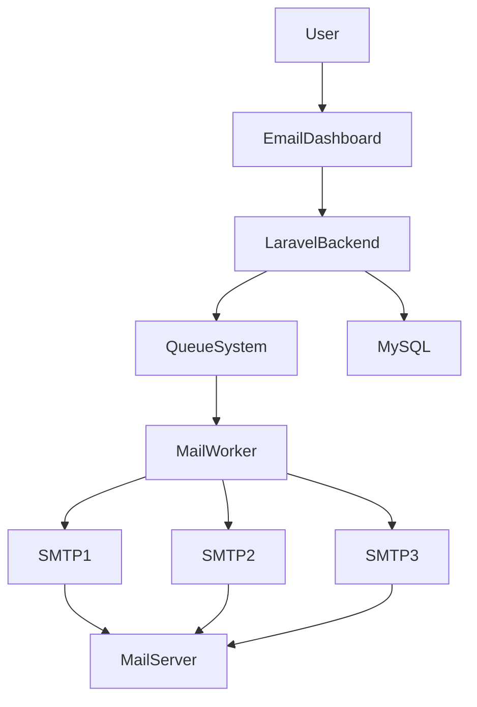

# Redmo Mail – Multi SMTP Email Marketing Platform

Redmo Mail is a scalable email marketing platform designed to solve the common problem of SMTP sending limits and spam detection when sending bulk emails.

The system allows multiple SMTP servers to be configured and automatically switches between them when one server reaches its sending limit.

---

## Features

### Multi SMTP Server Rotation

- Configure multiple SMTP servers
- Set sending limits
- Automatic SMTP switching
- Load-balanced email sending

---

### Bulk Email Sending

- Send emails to multiple recipients
- Support for large campaigns
- Send immediately or schedule later

---

### Dynamic Email Campaign

Upload Excel files containing email lists.

Example:

| Name | Email |
|-----|------|
| Rahim | rahim@email.com |

Use dynamic variables:

Hello {name}

---

### SMTP Management

Configure SMTP servers with:

- SMTP host
- Port
- Username
- Password
- Encryption
- Sender email
- Sending limits

---

### Email Dashboard

- Total email statistics
- Delivery reports
- Failed email tracking
- Monthly analytics

---

## System Architecture

---

## 👨‍💻 Developer

**Md Atikur Rahman**

Full Stack Web Developer  
CSE Student – State University of Bangladesh

---

## 📫 Contact

LinkedIn:  https://www.linkedin.com/in/atikurrahman1587

Github:  https://github.com/atikurrahman1587

Email: atikurrahman1587@gmail.com
